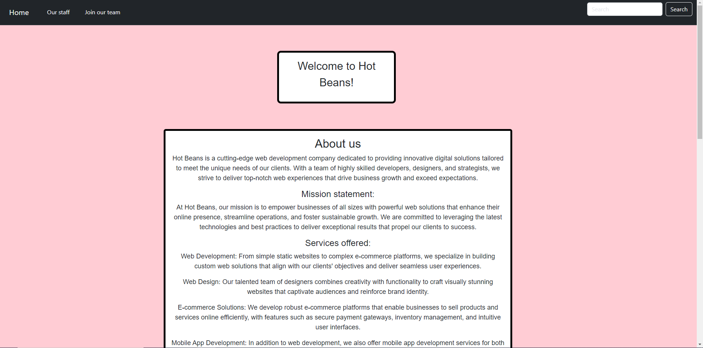
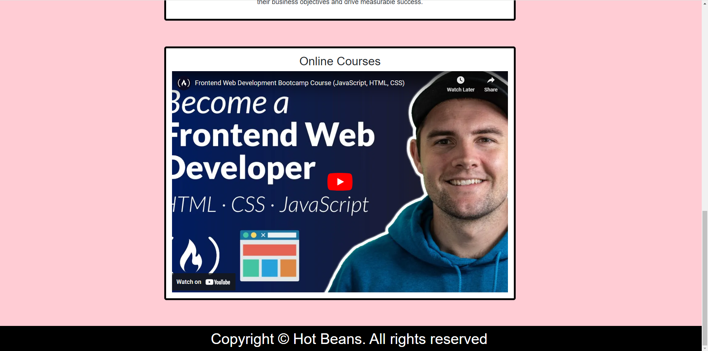
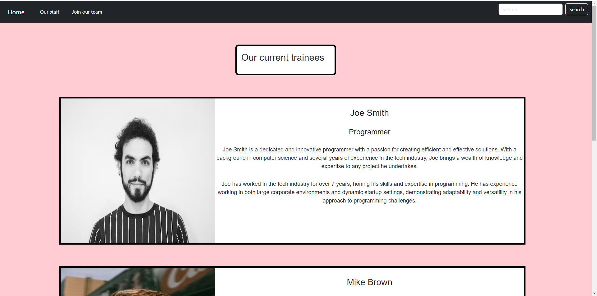
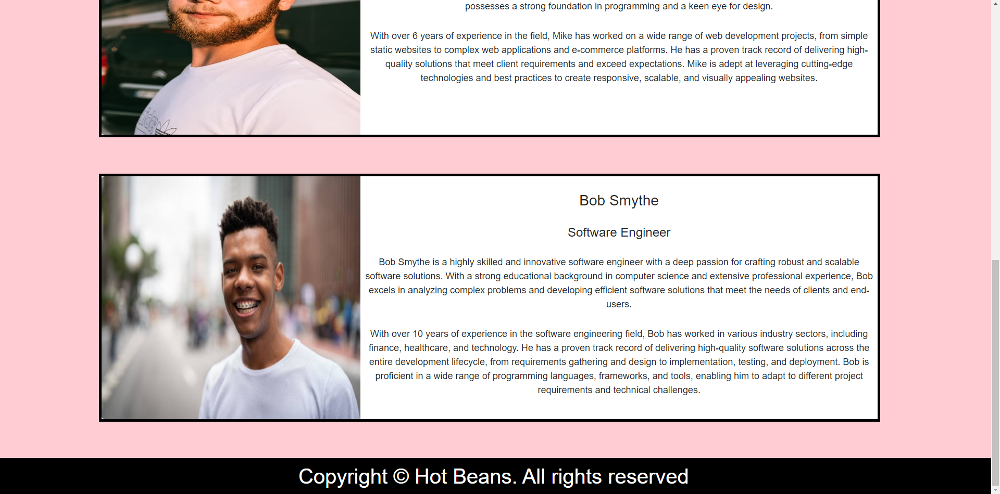
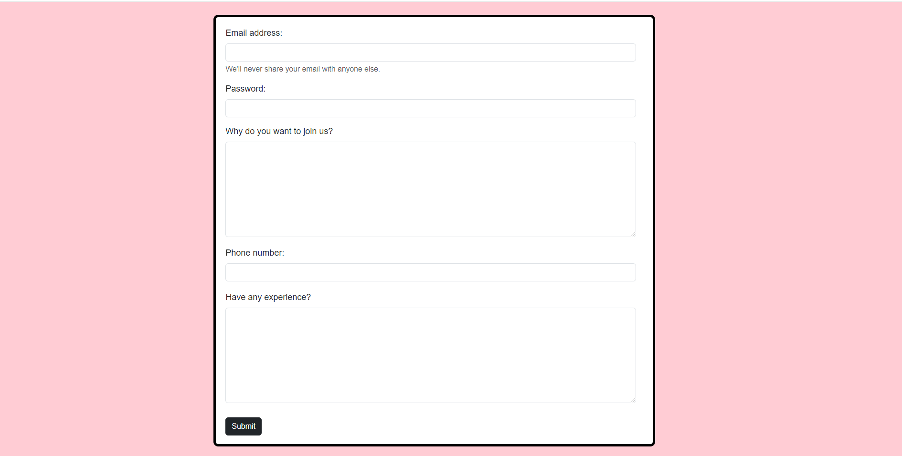
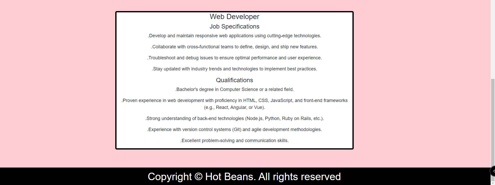

# Web development documentation 

## Task Plan

|   | Identify requirements  | Website storyboards  | Design website  |   
|---|---|---|---|
| Date | 30th January  | 2nd February  | 5th February  |  

|   | Justify design choices  | Review website  | Test website |   
|---|---|---|---|
| Date | 10th February  | 14th February  | 16th February  | 

|   | Gather feedback  | Optimize website | Evaluate optimized website |   
|---|---|---|---|
| Date | 19th February  | 21st February  | 23rd February  | 
 
## User Requirements

- Clear navigation - Ensure that the navigation is accessible from any web page and that it has clear and easy to understand structure so that users can direct themselves easily.

- Responsive website design - Make sure that the new section of Hot Beans website is responsive and works as intended and offers an easy viewing experience for users on any device.

- Clear and engaging company overview - The introduction to Hot Beans for potential employees needs to be engaging and provides great detail in terms of the companies aims, goals and intentions. Would also be ideal to include the companies background or recent work.

- Current trainee profiles - Would also be ideal to include testimonials from existing trainee web developers that are apart of the company. This will allow current employees to share their experience at Hot Beans and to give users more of an idea of what work is performed at Hot Beans.

- Professional/organized website design - Ensure that the website is visually pleasing and professional as it is a web development company and would have a higher chance of appealing to web developers than the website looking very unorganized.

- Simple application process - It is important to make the online application process as simple as possible. This can be done by clearly outlining the steps to users and it must be user-friendly with clear instructions and relevant fields whilst also making sure they are steps that will gather key information about the user and their relation with web development.

- Links to web development courses - It is also important to integrate links to maybe certain YouTube video web development course so that users can develop their web development skills.

- Provides specifications and qualifications - The website should also provide users with a description on the job specifications and qualifications so they are aware of what the company expects of them and what is required to join the team.

## Developer Requirements 

- Easy to understand code - Ensure that the code is easy to use and has good readability so that it will be easier to go back through and make any changes if needed.

- Code maintainability - Ensure code is maintained by to make sure that the code can be easily read and modified by the developer at any time. This can be done by regularly run tests and updates to ensure the stability of the code.

- Code testing - Write tests to validate the functionality of the different components. This will ensure the entire system will work as it was intended to.

- Code compatibility - It is also important to ensure the code is compatible and works on different browsers and devices. This can be done by conducting compatibility testing. 

- Leaving comments - Leaving comments within the code will make it much easier for the developer to understand what the intentions are in different parts of the code and make it more simple to navigate through the code.

## Web page storyboards + Justifications

In order to put my ideas for the websites appearance into visual perspective, I created some storyboards so to give an idea of what the storyboard can potentially look like.

### Home page

#### Content design: 

|   | A  | B  | C  | D | E |
|---|---|---|---|---|---|
| Type  | Nav bar  | Header  | Text Box  | Video Link  | Background |
| Width  | 100%  | 300px  | 900px | 900px | Web page width |
| Height  | 80px  | 125px  | 1150px  | 600px  | Web page height |
| Color  | #000000 | #FFFFFF  | #FFFFFF | Default colors  | #FFD6D6 |

I have decided to have this as my main design for the Hot Beans home page for a number of reasons. Firstly, this design achieves two of the clients requirements and that is showcasing a clear company overview as it contains a decently large section on introducing the company to users, plus it contains a video link that will direct users to web development courses which achieves in having web development video links. Secondly, I believe the nav bar achieves the requirement of having simple navigation since the names of web pages are specific and there isn't too many options to make it complex. Finally, the overall layout and the color scheme is neat and achieves in making the website visually organized and professional.

### Our staff page

#### Content design:

|   | A  | B  | C  | D | E |
|---|---|---|---|---|---|
| Type  | Nav bar  | Header  | Image  | Text box  | Background |
| Width  | 100%  | 300px  | 500px  | 1000px  | Web page width |
| Height  | 80px  | 125px  | 450px  | 450px  | Web page height |
| Color  | #000000 | #FFFFFF  | Default RGB image colors | #FFFFFF  | #FFD6D6 |

I have chosen this as my main design since it looks very appealing and professional which is one of the main user requirements listed. Firstly, it achieves in having clear navigation as I have made sure that it is also accessible for users on this page and has the same layout as it would on any other page. Secondly, the color scheme looks very professional and all of the colors mix well with each other and are suitable for the content they're applied to. The layout is very organized and simplistic which achieves the requirement of having the website visually professional. This also achieves showcasing the trainees experience at Hot Beans since the web page very clearly showcases it with the addition of the trainees personal profile image.

### Join our team page

#### Content design:

|   | A  | B  | C  | D | E | F | G | H |
|---|---|---|---|---|---|---|---|---|
| Type  | Nav bar  | Header  | Container  | Header  | Text box | Text box | Container | Background |
| Width  | 100%  | 300px  | 900px  | 300px  | 700px | 800px | 900px | Web page width |
| Height  | 80px  | 125px  | 600px  | 50px  | 30px | 200px | 400px | Web page height |
| Color  | #000000 | #FFFFFF  | #FFFFFF | #FFFFFF  | #FFFFFF | #FFFFFF | #FFFFFF | #FFD6D6 |

Here is the design I chose to be the main design for the 'Join our team' web page. Firstly, the main reason I chose this to be the main design is because of how well I  personally think it does at achieving the requirement of having a simple application process which is the main part that users will look for on this page, this makes it very user-friendly as it is straightforward and is clear as to what needs to be filled in. Secondly, it also includes the job specifications and qualifications that users will need to see which is a requirement for users and for the company as they need more recruits. Like other web pages, it also ensures that the nav bar is accessible and provides users with simple navigation to the other web pages, it has a very professional layout and organized layout whilst following the similar theme and color scheme as the other web pages.

## Alternate web page designs

Whilst creating the storyboards for the websites web pages, I ended up creating multiple potential designs for them. Here are the alternate designs I ended up not choosing due to a number of reasons as to why the ones I am using are much more suitable for achieving the clients requirements.

### Our Staff page (Alternate design)

.png)

#### Content design:

|   | A  | B  | C  | D | E |
|---|---|---|---|---|---|
| Type  | Nav bar  | Header  | Image  | Text box | Background |
| Width  | 100%  | 300px  | 900px | 900px  | Web page width |
| Height  | 80px  | 125px  | 650px  | 950px  | Web page height |
| Color  | #000000  | #000000  | Default RGB image colors  | #000000  | #FF6320 |

Here is the alternate design for the 'Our Staff' web page. Firstly, the color scheme is very different compared to the main design, this uses much more black by having it applied to the text boxes and headers and the background is also orange instead of a lighter pink. I believe the main design has a better color scheme as it contains a wider variety whilst looking more professional as the pink mixes with the white boxes much more nicely in contrast to orange and black.

Secondly, the layout of the web page is also different since the trainee profiles are in a row instead of a column. I believe the main design is better since the alternate design having them layed out in a row results in the images and text boxes being very compressed which can make spacing very odd for the text showcasing the trainees experience at Hot Beans which is something users will want to read. However, this does have the benefit of reducing the overall length of the web page reducing scrolling time for users but however considering the disadvantages, in my opinion, it is not worth it. 

### Join our team page (Alternate design)

.png)

#### Content design: 

|   | A  | B  | C  | D | E | F | G | H | I | J |
|---|---|---|---|---|---|---|---|---|---|---|
| Type  | Nav bar  | Header  | Container  | Header  | Text box | Text box | Text boxes | Text box | Container | Background |
| Width  | 100%  | 300px  | 900px  | 300px  | 700px | 800px | 30px | 800px | 900px | Web page width |
| Height  | 80px | 125px  | 1000px  | 50px  | 30px | 200px | 30px | 200px | 400px | Web page height |
| Color  | #000000 | #000000  | #000000 | #FFFFFF  | #FFFFFF | #FFFFFF | #FFFFFF | #FFFFFF | #000000 | #FF6320 |

Here is the alternate design for the 'Join our team' page. Even though the form has a number of content that I will definitely consider including on the form in the main design, the layout in my opinion however makes it unable to achieve the requirement of making the application form process as simple as possible for users. This problem mainly stems from the phone number text boxes, it would be better to have it as one text box so that it saves users time of having to fill in each individual box for one number, so I will definitely add this idea onto the form into the main design. Also, the 'have any experience?' question is also another feature I may add onto the main design since it gives Hot Beans more valuable information on the users that can be potential recruits, plus its simple for users to fill in and not complex. 

Like the last alternate design, the color scheme isn't really suitable and doesn't go well with what is on the web page. It is definitely visually more professional to changed the black text boxes to white and swap the orange to the pink background used on the main designs.

## Personal Review of Website

After creating the website based off my chosen storyboards, I decided to make my own personal review on the current designs of the different web pages. Here I cover what requirements the current website achieves and future ideas that can be implemented for improvement.

### Home page:

Firstly, I believe the home page gives off a very professional look for to users due to the simplistic layout and use of colors. The navigation at the top of the screen is also simple and easy to use to ensure that navigating through the website for users isn't complex. However, the search bar on the right-hand side can't be used yet as I haven't implemented the code for it to be functional yet, it would be best to have the search bar direct users to a notification that will explain this to make sure they're aware. The color scheme mainly consists of black and white with pink as the background. The text size is at a reasonable size which promotes readability and it uses 'Teko' sans-serf font style which is also readable and looks very suitable for a website based on web development. In my opinion, the 'About us' section on this page achieves the requirement of providing users with a clear and engaging company overview as it goes over many key details such as their mission statement, services offered and core values.

Towards the bottom of the home page I have also included a youtube video link which is a web development course for users that view this website and want to develop their web development skills, in my opinion, this achieves the requirement of the website containing links to web development course videos. I also decided to add a footer at the bottom of the web page to highlight where the end of the web page is and to prevent copyright infringement as it contains the copyright icon next to Hot Beans.

### Our staff page:

Firstly, the 'Our staff' web page has a similar layout and color scheme to the home page which is great as it proves the website maintains consistency throughout in terms of its design. However, one issue I did notice is the header 'Our current trainees' being off-centre, I have made sure to note this down and edit it to be more centered in future. Secondly, the trainee profiles are the main focus on this web page and personally I think they are great at showcasing current trainees experience at Hot Beans to give potential trainees viewing the website a better understanding of what Hot Beans expects from its employees and what work is performed, this is also one of the requirements which I believe it achieves.

The trainee profiles continue towards the end of the web page and they all provide the users insight onto current trainees experiences at Hot Beans. At the bottom of the page is the same footer with the same copyright information to prevent copyright infringement. The bottom of the ends pretty much the same as the home page and the overall design of the web page stays consistent throughout as it uses the same design choices used on the home page and others. 

### Join our team page:

Firstly, the top of the 'Join our team' web page consists of the same nav bar as the other pages in the website which proves the website maintains its consistency and it also improves the overall navigation since the nav bar is accessible on all web pages. The first piece of content users will be greeted to is a form for them to fill out if they want to join Hot Beans team, the form contains what was mentioned on the storyboard which is an email address, password and a 'Why do want to join us?' box. I also included other content that was on the alternate storyboard design as I thought they would be suitable to have on the user form, the new additions are a phone number and 'Have any experience?' box. I chose all of these to be included within the user form as I believe they achieve the requirement of having a simple application process with user-friendly steps and they are also steps that will have the user fill in relevant information related to web development. However, one issue I did notice with the form is the 'Why do you want to join us?' box will have any text start from the middle instead of from the top, I will make sure to edit this to make sure it starts from the top in future. The submit button at the bottom of the form doesn't functionally work like the search button on the nav bar, for now I will also have this direct users to a notification explaining this hasn't been implemented yet when clicked on.

At the bottom of the web page is simply a section that showcases the job specifications and qualifications for being a web developer at Hot Beans. This part of the web page follows the same design as the rest of the web page \and other web pages within the website. I believe this achieves the user requirement of providing clear specifications and qualifications required to join Hot Beans team, this is because it is able to highlight exactly what experience Hot Beans wants proof of and what technologies they expect users to have knowledge of and the exact qualifications needed. It also clearly covers what you'll be responsible for and is very descriptive about the users role as a web developer.

