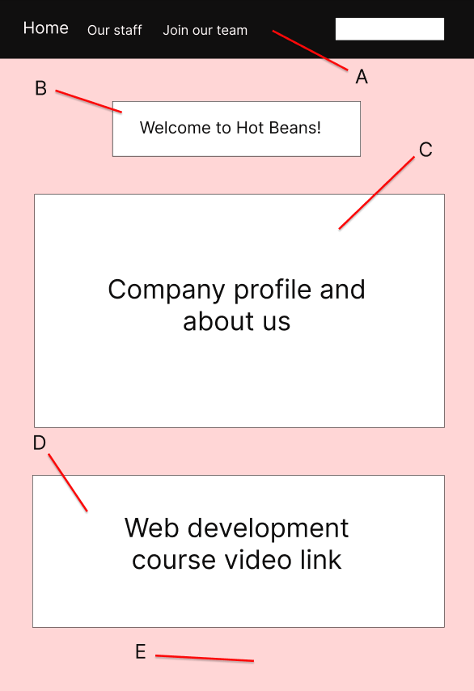
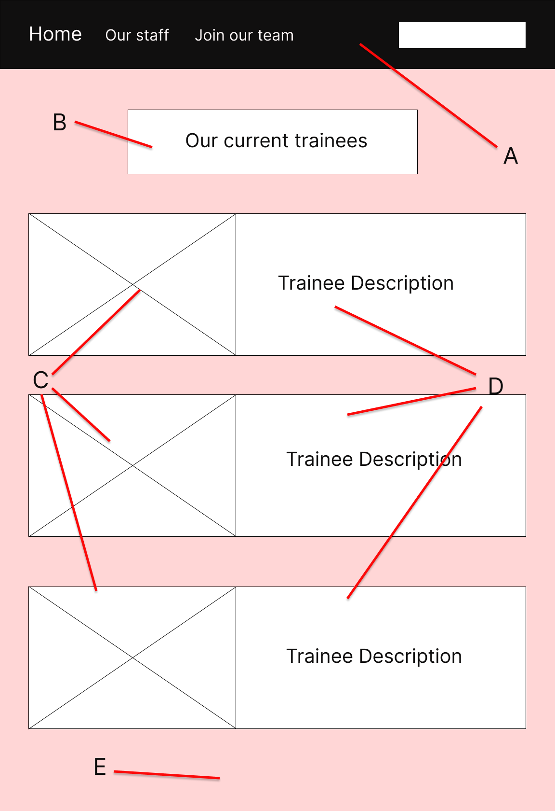
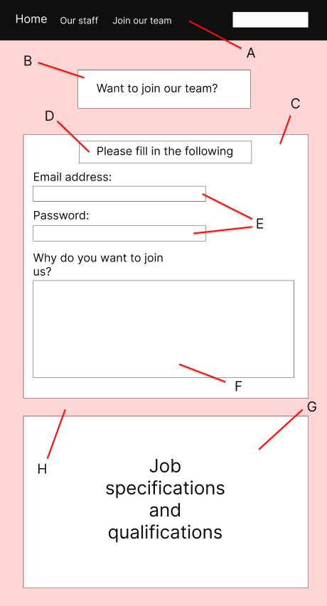

# Web development documentation 

## Task Plan

|   | Identify requirements  | Website storyboards  | Design website  |   
|---|---|---|---|
| Date | 30th January  | 2nd February  |   |  

|   | Justify design choices  | Test website  | Gather feedback |   
|---|---|---|---|
| Date |   |   |   | 

|   | Optimize website  | Gather evidence of optimized website | Evaluate optimized website |   
|---|---|---|---|
| Date |   |   |   | 
 
## User Requirements

- Clear navigation - Ensure that the navigation is accessible from any web page and that it has clear and easy to understand structure so that users can direct themselves easily.

- Responsive website design - Make sure that the new section of Hot Beans website is responsive and works as intended and offers an easy viewing experience for users on any device.

- Clear and engaging company overview - The introduction to Hot Beans for potential employees needs to be engaging and provides great detail in terms of the companies aims, goals and intentions. Would also be ideal to include the companies background or recent work.

- Trainee Testimony - Would also be ideal to include testimonials from existing trainee web developers that are apart of the company. This will allow current employees to share their experience at Hot Beans with users who can be potential future employees.

- Professional/organized website design - Ensure that the website is visually pleasing and professional as it is a web development company and would have a higher chance of appealing to web developers than the website looking very unorganized.

- Simple application process - It is important to make the online application process as simple as possible. This can be done by clearly outlining the steps to users and it must be user-friendly with clear instructions and relevant fields.

- Social media integration - It is also important to integrate links to maybe certain YouTube videos to showcase to users the companies purpose and what they do.

## Developer Requirements 

- Easy to understand code - Ensure that the code is easy to use and has good readability so that it will be easier to go back through and make any changes if needed.

- Code maintainability - Ensure code is maintained by to make sure that the code can be easily read and modified by the developer at any time. This can be done by regularly run tests and updates to ensure the stability of the code.

- Code testing - Write tests to validate the functionality of the different components. This will ensure the entire system will work as it was intended to.

- Code compatibility - It is also important to ensure the code is compatible and works on different browsers and devices. This can be done by conducting compatibility testing. 

- Leaving comments - Leaving comments within the code will make it much easier for the developer to understand what the intentions are in different parts of the code and make it more simple to navigate through the code.

## Web page storyboards + Justifications

In order to put my ideas for the websites appearance into visual perspective, I created some storyboards so to give an idea of what the storyboard can potentially look like.

### Home page

#### Content design: 

|   | A  | B  | C  | D | E |
|---|---|---|---|---|---|
| Type  | Nav bar  | Header  | Text Box  | Video Link  | Background |
| Width  |   |   |   |   | Web page width |
| Height  |   |   |   |   | Web page height |
| Color  | #000000 | #FFFFFF  | #FFFFFF | Default colors  | #FFD6D6 |

I have decided to have this as my main design for the Hot Beans home page for a number of reasons. Firstly, this design achieves two of the clients requirements and that is showcasing a clear company overview as it contains a decently large section on introducing the company to users, plus it contains a video link that will direct users to web development courses which achieves in having social media integration. Secondly, I believe the nav bar achieves the requirement of having simple navigation since the names of web pages are specific and there isn't too many options to make it complex. Finally, the overall layout and the color scheme is neat and achieves in making the website visually organized and professional.

### Our staff page

#### Content design:

|   | A  | B  | C  | D | E |
|---|---|---|---|---|---|
| Type  | Nav bar  | Header  | Image  | Text box  | Background |
| Width  |   |   |   |   | Web page width |
| Height  |   |   |   |   | Web page height |
| Color  | #000000 | #FFFFFF  | Default RGB image colors | #FFFFFF  | #FFD6D6 |

I have chosen this as my main design since it looks very appealing and professional which is one of the main user requirements listed. Firstly, it achieves in having clear navigation as I have made sure that it is also accessible for users on this page and has the same layout as it would on any other page. Secondly, the color scheme looks very professional and all of the colors mix well with each other and are suitable for the content they're applied to. The layout is very organized and simplistic which achieves the requirement of having the website visually professional. This also achieves showcasing the trainees experience at Hot Beans since the web page very clearly showcases it with the addition of the trainees personal profile image.

### Join our team page

#### Content design:

|   | A  | B  | C  | D | E | F | G | H |
|---|---|---|---|---|---|---|---|---|
| Type  | Nav bar  | Header  | Container  | Header  | Text box | Text box | Container | Background |
| Width  |   |   |   |   |  | | | Web page width |
| Height  |   |   |   |   |  | | | Web page height |
| Color  | #000000 | #FFFFFF  | #FFFFFF | #FFFFFF  | #FFFFFF | #FFFFFF | #FFFFFF | #FFD6D6 |

Here is the design I chose to be the main design for the 'Join our team' web page. Firstly, the main reason I chose this to be the main design is because of how well I  personally think it does at achieving the requirement of having a simple application process which is the main part that users will look for on this page, this makes it very user-friendly as it is straightforward and is clear as to what needs to be filled in. Secondly, it also includes the job specifications and qualifications that users will need to see which is a requirement for users and for the company as they need more recruits. Like other web pages, it also ensures that the nav bar is accessible and provides users with simple navigation to the other web pages, it has a very professional layout and organized layout whilst following the similar theme and color scheme as the other web pages.

## Alternate web page designs

Whilst creating the storyboards for the websites web pages, I ended up creating multiple potential designs for them. Here are the alternate designs I ended up not choosing due to a number of reasons as to why the ones I am using are much more suitable for achieving the clients requirements.

### Our Staff page (Alternate design)

.png)

#### Content design:

|   | A  | B  | C  | D | E |
|---|---|---|---|---|---|
| Type  | Nav bar  | Header  | Image  | Text box | Background |
| Width  |   |   | 883px | 883px  | Web page width |
| Height  |   |   | 679px  | 950px  | Web page height |
| Color  | #000000  | #000000  | Default RGB image colors  | #000000  | #FF6320 |

Here is the alternate design for the 'Our Staff' web page. Firstly, the color scheme is very different compared to the main design, this uses much more black by having it applied to the text boxes and headers and the background is also orange instead of a lighter pink. I believe the main design has a better color scheme as it contains a wider variety whilst looking more professional as the pink mixes with the white boxes much more nicely in contrast to orange and black.

Secondly, the layout of the web page is also different since the trainee profiles are in a row instead of a column. I believe the main design is better since the alternate design having them layed out in a row results in the images and text boxes being very compressed which can make spacing very odd for the text showcasing the trainees experience at Hot Beans which is something users will want to read. However, this does have the benefit of reducing the overall length of the web page reducing scrolling time for users but however considering the disadvantages, in my opinion, it is not worth it. 

### Join our team page (Alternate design)

.png)

#### Content design: 

|   | A  | B  | C  | D | E | F | G | H | I | J |
|---|---|---|---|---|---|---|---|---|---|---|
| Type  | Nav bar  | Header  | Container  | Header  | Text box | Text box | Text boxes | Text box | Container | Background |
| Width  |   |   |   |   |  | | |  | | Web page width |
| Height  |   |   |   |   |  | | |  | | Web page height |
| Color  | #000000 | #000000  | #000000 | #FFFFFF  | #FFFFFF | #FFFFFF | #FFFFFF | #FFFFFF | #000000 | #FF6320 |

Here is the alternate design for the 'Join our team' page. Even though the form has a number of content that I will definitely consider including on the form in the main design, the layout in my opinion however makes it unable to achieve the requirement of making the application form process as simple as possible for users. This problem mainly stems from the phone number text boxes, it would be better to have it as one text box so that it saves users time of having to fill in each individual box for one number, so I will definitely add this idea onto the form into the main design. Also, the 'have any experience?' question is also another feature I may add onto the main design since it gives Hot Beans more valuable information on the users that can be potential recruits, plus its simple for users to fill in and not complex. 

Like the last alternate design, the color scheme isn't really suitable and doesn't go well with what is on the web page. It is definitely visually more professional to changed the black text boxes to white and swap the orange to the pink background used on the main designs.